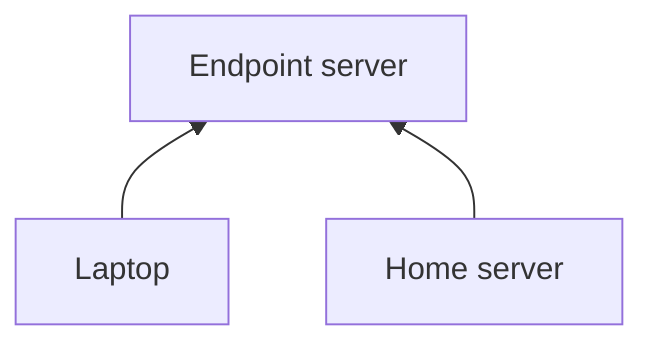
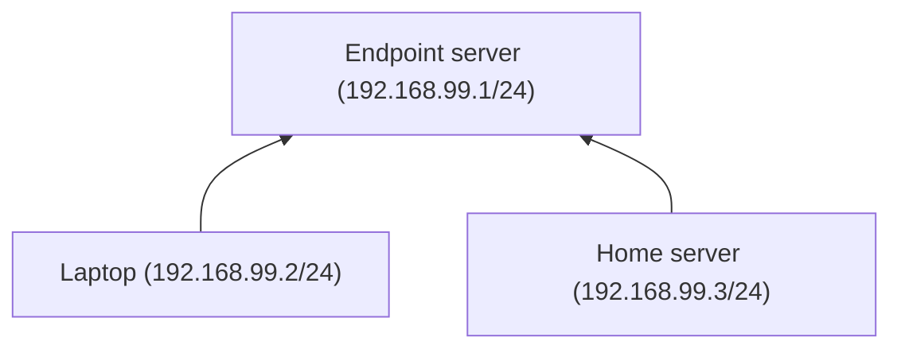

Multiple networks
===

## Overview

This is general interaction overview.

We have two networks: *home* and *vpn*

## Home network

Using this network we will be able to connect to our home server from the laptop no matter where are we trying to connect from. In other words: 192.168.99.2 can reach 192.168.99.3 via 192.168.99.1.

## VPN network

Some sites are blocked in our country, but we still want to access them, so we use our endpoint server as a gateway (do not forget to set proper AllowedIPs list and enable masquerade on the VPN server). And we specify preshared and public keys for our smartphone to list it on VPN server.
