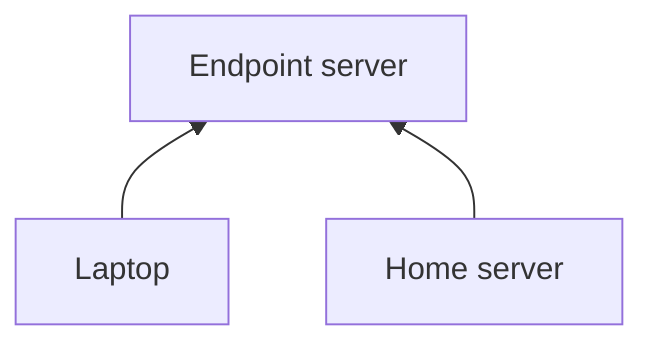
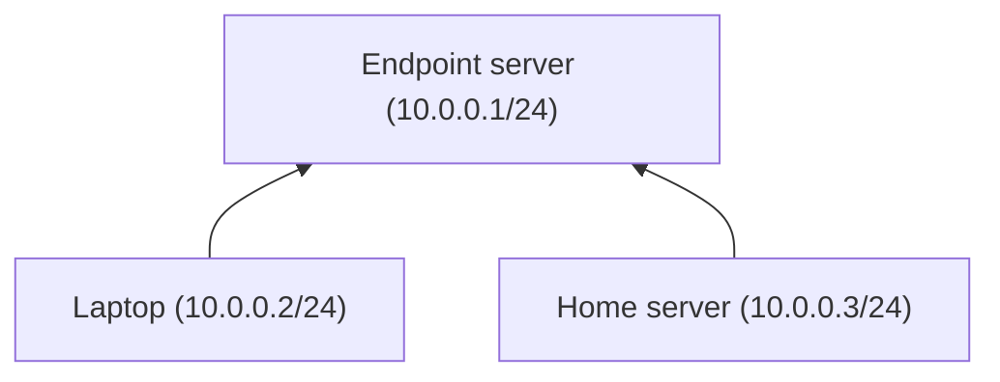
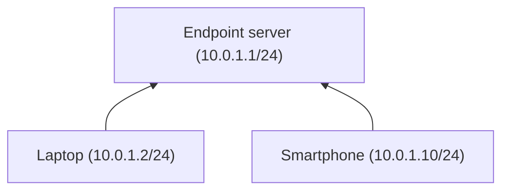

Multiple networks
===

## Overview

This is general interaction overview.

We have two networks: *home* and *vpn*

## Home network

Using this network we will be able to connect to our home server from the laptop no matter where are we trying to connect from. In other words: 10.0.0.2 can reach 10.0.0.3 via 10.0.0.1.

## VPN network

Some sites are blocked in our country, but we still want to access them, so we use our endpoint server as a gateway (do not forget to set proper AllowedIPs list and enable masquerade on the VPN server). And also, we have a smartphone that, of course, cannot be added to the inventory directly, so we *specify its public and preshared keys in the vars directly* and also *set static keys for endpoint server to use* (because we do not want to configure VPN on the tablet after each ansible run because endpoint's keys can be regenerated)
